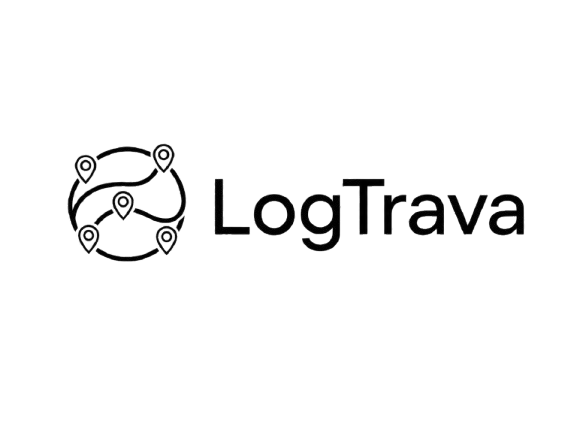

  

<h1 align="center">LogTrava</h1>

---

<em>Adaptive route optimization for high-stakes energy logistics.</em>

  
  
  
  

  
  

---

## What is LogTrava?

LogTrava is a sophisticated route optimizer engineered specifically for high-stakes energy logistics.

Unlike generic software that relies solely on static GPS data, LogTrava's core strength lies in its adaptive learning algorithms. It ingests historical trip data to understand exactly how your drivers navigate traffic and manage pressure risks, creating dynamic routes that account for depot readiness and driver capability.

This transforms your dispatch from a rigid planning exercise into a human-informed optimization engine, ensuring safer delivery windows without increasing costs or overtime.

## The Problem

Traditional route planning relies on static GPS data and ignores how drivers actually perform under real-world conditions and could leading to traffic unpredictability, pressure risks, and varying depot readiness. This leads to missed delivery windows, increased overtime costs, and higher safety risks that generic software cannot address.

## How LogTrava Solves It

LogTrava standardizes route planning through adaptive learning, turning a rigid dispatch process into an intelligent optimization layer that runs *without disrupting existing logistics workflows.*

| Step | What happens |
| --- | --- |
| **1. Ingest** | Historical trip data and driver behavior patterns are collected from your fleet operations. |
| **2. Learn** | Adaptive algorithms analyze each driver's navigation habits and risk profile over time. |
| **3. Optimize** | Dynamic routes are generated based on depot readiness, traffic conditions, and driver capability. |
| **4. Execute** | Dispatch delivers safer, on-time routes with real-time visibility and tracking. |

### Core capabilities

- **Adaptive Route Learning** -- learns from real driver behavior, not just static GPS data.
- **Driver Risk Profiling** -- personalized risk assessment for each driver based on historical performance.
- **Depot Readiness Integration** -- routes adapt to actual depot conditions and operational constraints.
- **Real-Time Fleet Dashboard** -- live visibility into delivery status, route adherence, and fleet performance.
- **Cost-Neutral Optimization** -- safer delivery windows without increasing costs or overtime.

## Summary

  <video src="https://github.com/user-attachments/assets/07955670-fd9b-43a9-a1d3-6948e5c5903d" 
    controls width="100%" style="max-width: 800px; border-radius: 12px; box-shadow: 0 4px 20px rgba(0,0,0,0.3);"></video>

### Feature Highlights

  <video src="assets/LogTrava_SummaryVideo.mp4" autoplay muted loop playsinline width="100%" style="max-width: 800px; border-radius: 12px; box-shadow: 0 4px 20px rgba(0,0,0,0.3);"></video>

## Dashboard

The LogTrava Dashboard provides real-time visibility into fleet operations, route performance, and driver analytics. Key metrics include on-time delivery rates, route adherence scores, fuel efficiency tracking, and driver risk profiles -- all presented in a clean, actionable interface for dispatchers and fleet managers.

## Vision & Mission

**Vision:** To become the global standard for intelligent energy logistics, where every route is optimized for safety, efficiency, and human performance.

**Mission:** Empower energy logistics companies with adaptive routing technology that learns from real-world driver behavior and operational constraints, reducing delivery risks and costs while maximizing fleet productivity.

## Business Model

SaaS subscription with tiered pricing based on fleet size and feature needs.

## Contact

For inquiries, partnerships, or demo requests:

- **Email:** contact@logtrava.com
- **Website:** [www.logtrava.com](https://logtrava.com)
- **Service Status:** [status.logtrava.com](https://status.logtrava.com)
